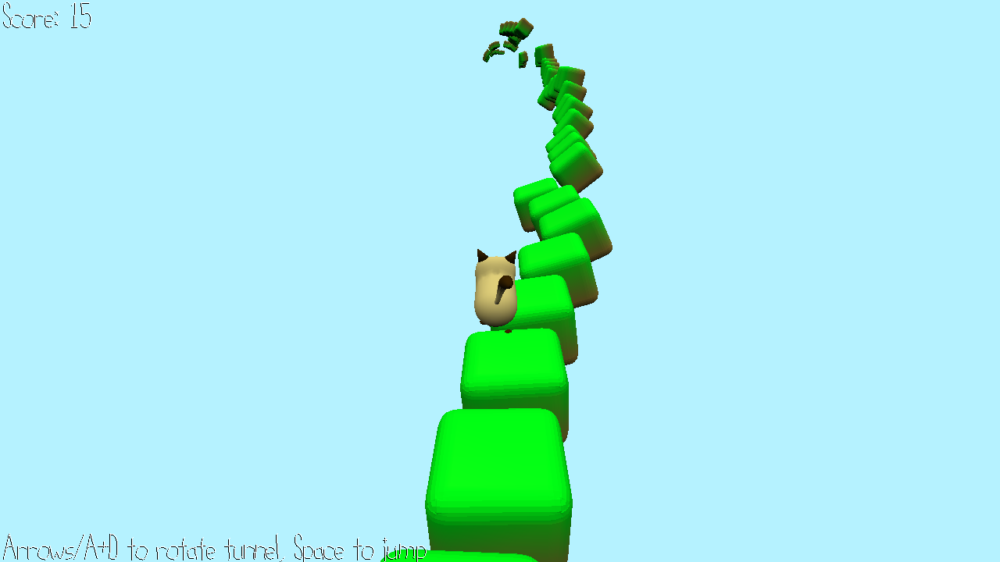

# Cat Run

Author: Anne He and George Ralph

Design: An endless procedurally generated runner, but you spin the tiles to prevent the bouncy cat from falling.

Screen Shot:

How To Play:

Use arrows or A/D to rotate the tiles. Press space to jump.

Sources: Assets created by us. Tile spawning referenced from https://github.com/lassyla/game2.

This game was built with [NEST](NEST.md).

