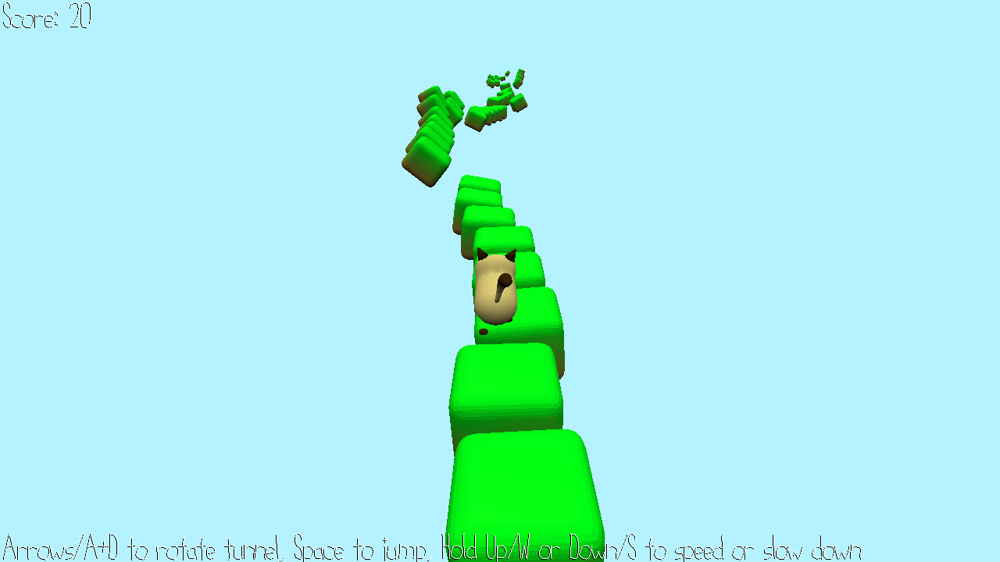

# Cat Run

Author: Anne He and George Ralph

Design: You are a (time lord?) cat in an endless procedurally generated runner. Spin the tiles to prevent yourself from falling.

Screen Shot:

How To Play:

Use arrows or A/D to rotate the tiles. Press space to jump. Hold Up/W or Down/S to speed up and slow
down. Changing time is powerful but also tricky. The speed of the game increases as you progress.

Sources: Assets created by us. 
Referenced 15-466 F21 Game 2 base code.
Tile spawning referenced from https://github.com/lassyla/game2.
Soundtrack is "In Game" by BloodPixelHero, from https://freesound.org/people/BloodPixelHero/sounds/580898/.

This game was built with [NEST](NEST.md).

